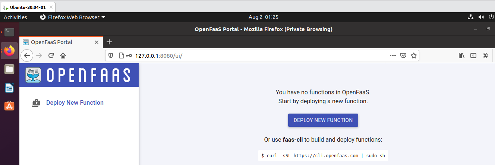

# Lab 1 - Prepare for OpenFaaS

Mục tiêu bài Lab:
- Cài đặt Docker, Kubernetes, OpenFaaS
- Đăng nhập vào OpenFaaS
- Tạo local cluster

## Cài đặt Docker

```
sudo apt-get remove docker docker-engine docker.io containerd runc

sudo apt-get update

sudo apt-get install -y apt-transport-https ca-certificates curl gnupg-agent software-properties-common

curl -fsSL https://download.docker.com/linux/ubuntu/gpg | sudo apt-key add -

sudo add-apt-repository "deb [arch=amd64] https://download.docker.com/linux/ubuntu $(lsb_release -cs) stable"

sudo apt-get updatee

sudo apt-get install docker-ce docker-ce-cli containerd.io
```

Hoặc

```
curl -fsSL https://get.docker.com -o get-docker.sh

sudo sh get-docker.sh
```

Kiểm tra
```
sudo docker run hello-world

sudo docker version
```

Để không sử dụng lệnh `sudo` mỗi lần chạy Docker
```
sudo usermod -aG docker your-user
```

Gỡ cài đặt Docker
```
sudo apt-get purge docker-ce docker-ce-cli containerd.io

sudo rm -rf /var/lib/docker
```

Tham khảo ở đây: https://docs.docker.com/engine/install/ubuntu/

## Cài đặt Kubernetes

> Bước này nên chuyển qua super user của OS `sudo -s`

```
export VER=$(curl -s https://storage.googleapis.com/kubernetes-release/release/stable.txt)
curl -LO https://storage.googleapis.com/kubernetes-release/release/$VER/bin/linux/amd64/kubectl
chmod +x kubectl
mv kubectl /usr/local/bin/
```

## Cài đặt OpenFaaS CLI

```
curl -sLSf https://cli.openfaas.com | sudo sh
```


Kiểm tra
```
faas-cli version

faas-cli help
```

## Đăng nhập Docker Hub

Đăng ký Docker hub ở đây: https://hub.docker.com

```
docker login
```

## Tạo Kubernetes cluster

### Tạo local cluster

**k3d thuộc k3s**

- Cài đặt k3d

```
curl -s https://raw.githubusercontent.com/rancher/k3d/main/install.sh | bash
```

- Bắt đầu tạo cluster

```
k3d create
```

> k3d ver3 sử dụng lệnh `k3d cluster create`

```
export KUBECONFIG="$(k3d get-kubeconfig --name='k3s-default')"
kubectl cluster-info 
```

Kiểm tra
```
k3d version
```

Để xóa k3d, ta dùng
```
k3d delete
```

> k3d ver3 xóa sử dụng `k3d cluster delete`

### Triển khai OpenFaaS

- Cài đặt arkade

```
curl -SLsf https://dl.get-arkade.dev/ | sudo sh
```

- Cài OpenFaaS

```
arkade install openfaas
```

> Hoặc cần load balancer sử dụng `arkade install openfaas --load-balancer`

```
root@ubuntu:/home/tx8/Desktop# arkade install openfaas
Using kubeconfig: 
Using helm3
Node architecture: "amd64"
Client: "x86_64", "Linux"
2020/08/02 00:23:02 User dir established as: /root/.arkade/
https://get.helm.sh/helm-v3.1.2-linux-amd64.tar.gz
/root/.arkade/bin/helm3/linux-amd64 linux-amd64/
/root/.arkade/bin/helm3/helm linux-amd64/helm
/root/.arkade/bin/helm3/README.md linux-amd64/README.md
/root/.arkade/bin/helm3/LICENSE linux-amd64/LICENSE
2020/08/02 00:23:05 extracted tarball into /root/.arkade/bin/helm3: 3 files, 0 dirs (2.463618929s)
"openfaas" has been added to your repositories

Hang tight while we grab the latest from your chart repositories...
...Successfully got an update from the "openfaas" chart repository
Update Complete. ⎈ Happy Helming!⎈ 
VALUES values.yaml
Command: /root/.arkade/bin/helm3/helm [upgrade --install openfaas openfaas/openfaas --namespace openfaas --values /tmp/charts/openfaas/values.yaml --set queueWorker.maxInflight=1 --set clusterRole=false --set gateway.directFunctions=true --set openfaasImagePullPolicy=IfNotPresent --set basicAuthPlugin.replicas=1 --set queueWorker.replicas=1 --set serviceType=NodePort --set operator.create=false --set faasnetes.imagePullPolicy=Always --set gateway.replicas=1 --set ingressOperator.create=false --set basic_auth=true]
Release "openfaas" does not exist. Installing it now.
NAME: openfaas
LAST DEPLOYED: Sun Aug  2 00:23:11 2020
NAMESPACE: openfaas
STATUS: deployed
REVISION: 1
TEST SUITE: None
NOTES:
To verify that openfaas has started, run:

  kubectl -n openfaas get deployments -l "release=openfaas, app=openfaas"
=======================================================================
= OpenFaaS has been installed.                                        =
=======================================================================

# Get the faas-cli
curl -SLsf https://cli.openfaas.com | sudo sh

# Forward the gateway to your machine
kubectl rollout status -n openfaas deploy/gateway
kubectl port-forward -n openfaas svc/gateway 8080:8080 &

# If basic auth is enabled, you can now log into your gateway:
PASSWORD=$(kubectl get secret -n openfaas basic-auth -o jsonpath="{.data.basic-auth-password}" | base64 --decode; echo)
echo -n $PASSWORD | faas-cli login --username admin --password-stdin

faas-cli store deploy figlet
faas-cli list

# For Raspberry Pi
faas-cli store list \
 --platform armhf

faas-cli store deploy figlet \
 --platform armhf

# Find out more at:
# https://github.com/openfaas/faas

Thanks for using arkade!
```

Nâng cao hơn, hãy cài OpenFaaS sử dụng [helm chart](https://github.com/openfaas/faas-netes/blob/master/chart/openfaas/README.md)

### Đăng nhập vào OpenFaaS Gateway

```
kubectl rollout status -n openfaas deploy/gateway

kubectl port-forward -n openfaas svc/gateway 8080:8080 &

PASSWORD=$(kubectl get secret -n openfaas basic-auth -o jsonpath="{.data.basic-auth-password}" | base64 --decode; echo)

echo -n $PASSWORD | faas-cli login --username admin --password-stdin
```

Truy cập http://127.0.0.1:8080

Sử dụng tên tài khoản `admin`. Mật khẩu dùng lệnh `echo $PASSWORD`



Hoàn thành! Qua [lab2](lab2.md)